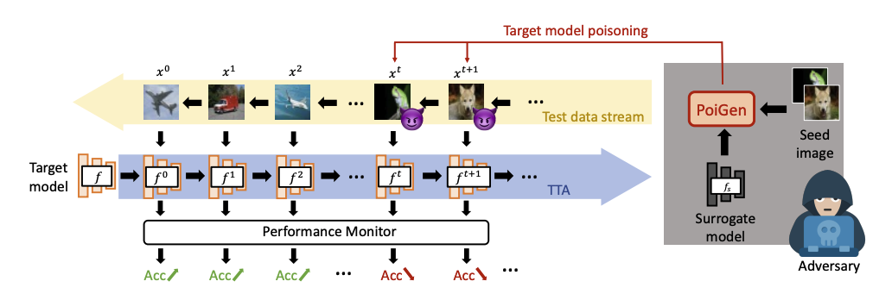
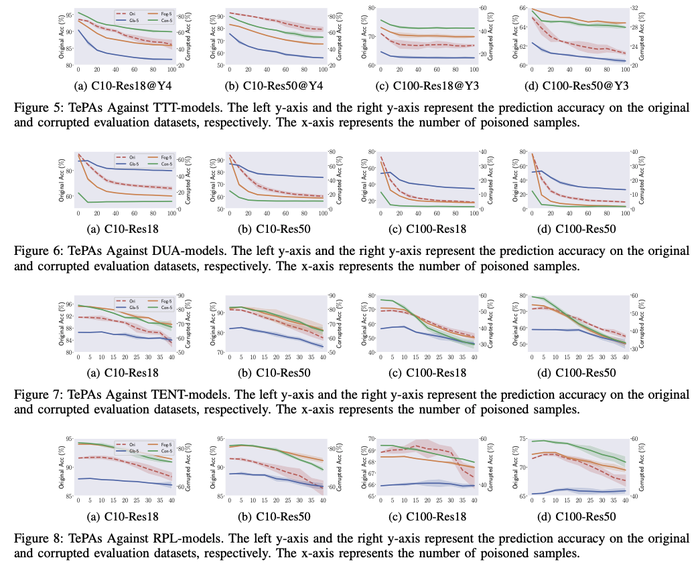

# 🎃TePA (IEEE S&P 2024)

[](https://arxiv.org/abs/2308.08505)
<a href="https://pytorch.org/get-started/locally/"></a>

This repository contains the PyTorch implementation of the paper "[Test-Time Poisoning Attacks Against Test-Time Adaptation Models](https://arxiv.org/abs/2308.08505)" by [Tianshuo Cong](https://tianshuocong.github.io/), [Xinlei He](https://xinleihe.github.io/), [Yun Shen](https://scholar.google.com/citations?hl=en&user=Gx_JJ6cAAAAJ), and [Yang Zhang](https://yangzhangalmo.github.io/).
In particular, we propose the first *test-time* poisoning attack against four mainstream test-time adaptation methods, including TTT, DUA, TENT, and RPL. Here is the workflow of TePA:

<div align="center">

</div>

## Citation ☺️
Thanks for your interest in our paper, please feel free to leave a ⭐️ or cite us, thanks!
```bibtex
@inproceedings{cong2024tepa,
  title={Test-Time Poisoning Attacks Against Test-Time Adaptation Models},
  author={Tianshuo Cong and Xinlei He and Yun Shen and Yang Zhang},
  booktitle={IEEE Symposium on Security and Privacy (S\&P)},
  year={2024}
}
```

## Requirements 🔧
TePA depends on the following requirements:
- Basic: PyTorch 1.11.0, Python 3.8, Cuda 11.3
- Others:
  - TTT: https://github.com/yueatsprograms/ttt_cifar_release
  - TENT: https://github.com/DequanWang/tent
  - DUA: https://github.com/jmiemirza/DUA

## Baseline 🎯
- First, we should check the utility of the frozen target model, and the utility of the TTT (using clean i.i.d. samples), run the following code, and then we can get the results of Figure 4 and Table 1 of our paper.
```
python TTT/utility.py
python DUA/utility.py
python TENT/utility.py --cfg cfgs/tent_sgd.yaml
python RPL/utility.py --cfg cfgs/rpl_sgd.yaml 
```


## Poison TTA-models 🦠
Algorithm-1 is implemented in `TTA/poigen.py`, here we use DIM as the transfer-based adversarial attack method. After generating poisoned samples by `poigen.py`, we upload the poisoned samples to target TTA-models through running:  
```
python TTT/poison_ttt.py
python DUA/poison_dua.py
python TENT/poison_tent.py --cfg cfgs/tent_sgd.yaml
python RPL/poison_rpl.py --cfg cfgs/rpl_sgd.yaml 
```
Then, we can get the results of Figure 5-8.

<div align="center">

</div>

## Dataset 💾
Please download the following datasets through the official website and 
- CIFAR-10 & CIFAR-100: https://www.cs.toronto.edu/~kriz/cifar.html
- CIFAR-10-C: https://zenodo.org/records/2535967
- CIFAR-100-C: https://zenodo.org/records/3555552
- CINIC-10: https://github.com/BayesWatch/cinic-10

## Models 🕸
You can download the checkpoints here:
- TTT:
  - Target Models:
    - [ResNet18-Y4 pre-trained on CIFAR-10](https://drive.google.com/file/d/1f524MN_rZfXoyReE0hdJFfVwesz_vrLp/view?usp=sharing)
    - [ResNet18-Y3 pre-trained on CIFAR-100](https://drive.google.com/file/d/1nycPhkWNG66ooi9iK9eC2_eIKvMjCOUF/view?usp=sharing)
    - [ResNet50-Y4 pre-trained on CIFAR-10](https://drive.google.com/file/d/11Q43JwSPTQgWe9nN4qjnKY1GfwecK4UT/view?usp=sharing)
    - [ResNet50-Y3 pre-trained on CIFAR-100](https://drive.google.com/file/d/1kAuKDXItyszY8P035cSBkcg-wtTLUWbx/view?usp=sharing)
  - Surrogate Model:
    - [ResNet18-Y3 pre-trained on CINIC-10 (without CIFAR-10)](https://drive.google.com/file/d/18QdOFZxxeyQ00bgsrYZTV-AbZUwiXknL/view?usp=sharing)
- DUA & TENT & RPL:
  - Target Models:
    - [ResNet18 pre-trained on CIFAR-10](https://drive.google.com/file/d/1hEIjT2zwvxZp6T1FhoxqGFYVQ1W3fNuI/view?usp=sharing)
    - [ResNet18 pre-trained on CIFAR-100](https://drive.google.com/file/d/1c4tukwIM7dUWMpZMDUu86YpRxImCGaug/view?usp=sharing)
    - [ResNet50 pre-trained on CIFAR-10](https://drive.google.com/file/d/1Qek-n8YZg2kb4lYZjgB29lShKasSIWQU/view?usp=sharing)
    - [ResNet50 pre-trained on CIFAR-100](https://drive.google.com/file/d/1-F2XuBEN4piYxdNmo0ryIO5EFRYDvrjA/view?usp=sharing)
  - Surrogate Model (only for poisoning TENT and RPL):
    - [VGG-11 pre-trained on CINIC-10 (without CIFAR-10)](https://drive.google.com/file/d/1xsgYAewsNUB-V9HJ_vpj41ggDCoXEWn9/view?usp=sharing)

## Acknowledgements 🌻
Our code is built upon the public code of the [TTT](https://github.com/yueatsprograms/ttt_cifar_release), [TENT](https://github.com/DequanWang/tent), and [DUA](https://github.com/jmiemirza/DUA).
